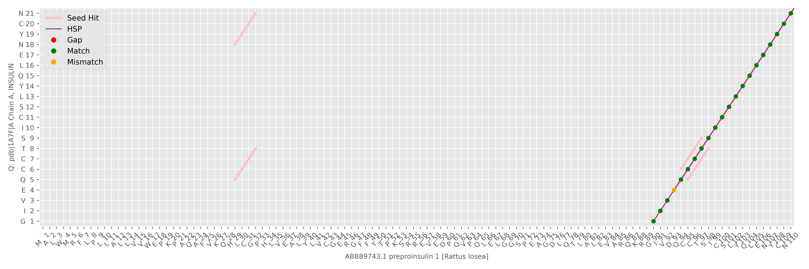

# BLAST

Protein BLAST Implementation

## How to Use:
1. **Set Up Configuration**: Adjust parameters in `config.py` (e.g., `K`, `T`, gap penalties).
2. **Add Sequences**: Place your query sequence in `query.fasta` and the database sequences in `database.fasta`.
3. **Run the Code**: Execute `main.py` to perform the search and generate results.
4. **View Results**: Check `result.txt` for alignment details and `.png` files for graphical representations of matches.

